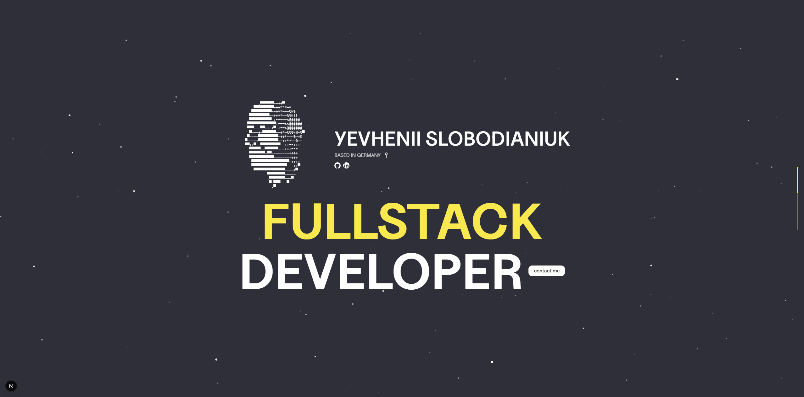

#### Link: https://yevhenii-slobodianiyk-portfolio.vercel.app/

## Overview

Personal portfolio website showcasing projects, skills, and contact information. Built as a fast, interactive single-site experience with smooth animations and 3D touches.

## Tech Stack

- Next.js for the application framework
- Tailwind CSS for styling
- GSAP for animations
- Lenis for smooth scrolling
- Three.js and React Three Fiber for 3D scenes
- Nodemailer for contact form email delivery

## Setup

1. Install dependencies

   npm install

2. Create a `.env.local` file in the project root:

   EMAIL_USER=your.email@example.com
   EMAIL_PASS=your-app-password

3. Start the dev server

   npm run dev

